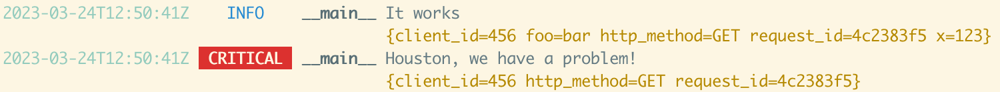

<!-- WARNING: generated from README.md.j2, do not modify this file manually but modify README.md.j2 instead
     and execute 'poetry run poe make_readme' to regenerate this README.md file -->

# stlog

<!--intro-start-->

## What is it?

**ST**andard **ST**ructured **LOG** (`stlog`) is Python 3.7+ [structured logging](#structured) library:

- built on [standard python logging](https://docs.python.org/3/library/logging.html) and [contextvars](https://docs.python.org/3/library/contextvars.html)
- very easy to configure with "good/opinionated" default values
- which produces great output **for both humans and machines**
- which believes in [Twelve-Factor App](https://12factor.net/) principles about config and logs
- **dependency free** (but can use fancy stuff (colors, augmented traceback...) from the [rich library](https://github.com/Textualize/rich) *(if installed)*)

## Features

- **standard, standard, standard**: all stlog objects are built on [standard python logging](https://docs.python.org/3/library/logging.html) and are compatible with:
    - other existing handlers, formatters...
    - libraries which are using a standard logger *(and `stlog` can automatically reinject the global context in log records produced by these libraries)*
- easy shorcuts to configure your logging
- provides nice outputs **for humans AND for machines** *(you can produce both at the same time)*
- structured with 4 levels of context you can choose or combine:
    - a global one set by environment variables *(read at process start)*
    - a kind of global one (thanks to [contextvars](https://docs.python.org/3/library/contextvars.html))
    - a context linked to the logger object itself (defined during its building)
    - a context linked to the log message itself
- a lot of configuration you can do with environment variables (in the spirit of [Twelve-Factor App](https://12factor.net/) principles)

## Non-Features

- *"A twelve-factor app never concerns itself with routing or storage of its output stream."*
    - we are going to make an exception on this for log files *(see roadmap)*
    - but we don't want to introduce complex/network outputs like syslog, elasticsearch, loki...
- standard, standard, standard: we do not want to move away from [standard python logging](https://docs.python.org/3/library/logging.html) compatibility 

## <a name="structured"></a> What is *structured logging*?

> Structured logging is a technique used in software development to produce log messages that are more easily parsed and analyzed by machines. 
> Unlike traditional logging, which typically consists of free-form text messages, structured logging uses a well-defined format that includes
> named fields with specific data types.
> 
> The benefits of structured logging are many. By using a standard format, it becomes easier to automate the processing and analysis of logs.
> This can help with tasks like troubleshooting issues, identifying patterns, and monitoring system performance. It can also make it easier
> to integrate logs with other systems, such as monitoring and alerting tools.
> 
> Some common formats for structured logging include JSON, XML, and key-value pairs. In each case, the format includes a set of fields that provide information about the log message, such as the severity level, timestamp, source of the message, and any relevant metadata.
> 
> Structured logging is becoming increasingly popular as more developers recognize its benefits. Many logging frameworks and libraries now include support for structured logging, making it easier for developers to adopt the technique in their own projects.
>
> (thanks to ChatGPT)

<!--intro-end-->

## Quickstart

<!--quickstart-start-->

### Installation

```
pip install stlog
```

### Usage

```python
from stlog import ExecutionLogContext, getLogger, setup

# Set the logging default configuration (human output on stderr)
setup()

# ...

# Set the (kind of) global execution context
# (thread, worker, async friendly: one context by execution)
# (for example in a wsgi/asgi middleware)
# Note: ExecutionContext is a static class, so a kind of global singleton
ExecutionLogContext.reset_context()
ExecutionLogContext.add(request_id="4c2383f5")
ExecutionLogContext.add(client_id=456, http_method="GET")

# ... in another file/class/...

# Get a logger
logger = getLogger(__name__)
logger.info("It works", foo="bar", x=123)
logger.critical("Houston, we have a problem!")
```

Output (without `rich` library installed):

```
2023-03-24T12:47:37Z [INFO]     (__main__) It works {client_id=456 foo=bar http_method=GET request_id=4c2383f5 x=123}
2023-03-24T12:47:38Z [CRITICAL] (__main__) Houston, we have a problem! {client_id=456 http_method=GET request_id=4c2383f5}
```

Output (with `rich` library installed):



What about if you want to get a more parsing friendly output (for example in JSON on `stdout`) while keeping the human output on `stderr` (without any context)?

Change the "setup" part:

```python
import sys
from stlog import ExecutionLogContext, getLogger, setup
from stlog.output import StreamOutput
from stlog.formatter import HumanFormatter, JsonFormatter

setup(
    outputs=[
        StreamOutput(stream=sys.stderr, formatter=HumanFormatter(exclude_extras_keys_fnmatchs=["*"])),
        StreamOutput(stream=sys.stdout, formatter=JsonFormatter(indent=4))
    ]
)

# [...] see previous example
```

`stderr` ouput will be (for humans): 

```
2023-03-24T13:05:04Z [INFO]     (__main__) It works
2023-03-24T13:05:04Z [CRITICAL] (__main__) Houston, we have a problem!
```

`stdout` output will be (for machines):

```json
{
    "status": "info",
    "logger": {
        "name": "__main__"
    },
    "source": {
        "path": "/home/fab/src/standard-structlog/toto.py",
        "lineno": 28,
        "module": "toto",
        "funcName": "<module>",
        "process": 2431368,
        "processName": "MainProcess",
        "thread": 140184194897728,
        "threadName": "MainThread"
    },
    "message": "It works",
    "timestamp": "2023-03-24T13:05:04Z",
    "x": 123,
    "foo": "bar",
    "request_id": "4c2383f5",
    "http_method": "GET",
    "client_id": 456
}
[...] the critical json message is hidden here to limit the size of the output
```

<!--quickstart-end-->

## Roadmap

- [ ] add `file` outputs
- [ ] add a full `logfmt` formatter
